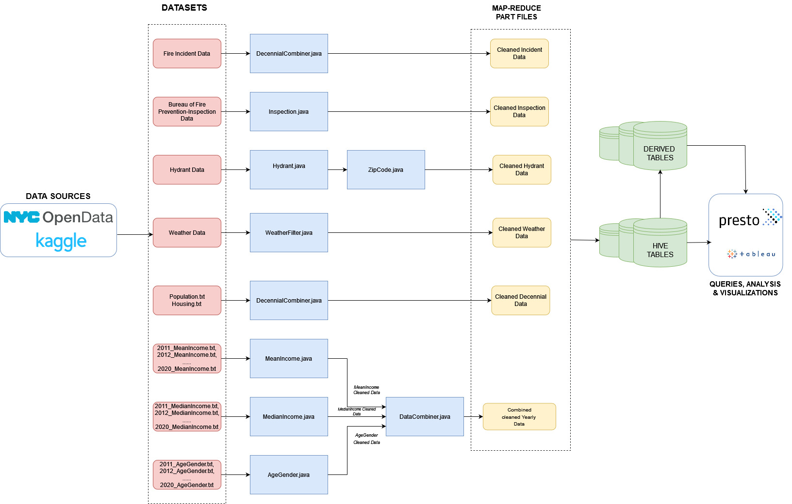

# IGNITECH : Fighting Fire With Data

## Data Cleaning and Profiling on Decennial,Income & Weather Data  
By Anoushka Gupta 
### Overview
Used Hadoop and MapReduce to clean the Decennial, Income and Weather Data. Analyzed required columns, inconsistencies in file formats over the years and aggregation of data across various folders into one easily usable cleaned data file.

### Project Structure

Census Data
- **AgeGender.java:** Data cleaning and extraction of AgeGender data across 10 years.
- **MeanIncome.java:** MapReduce job for cleaning and processing Mean Income zipcode and year wise
- **MedianIncome.java:** MapReduce job for cleaning and processing Median Income zipcode and year wise
- **MeanProfiler.java:** Java Program for profiling the Mean income. Calculates the maximum and minimum mean income for each year and its corresponding zipcodes.
- **DataCombiner.java:** MapReduce for combining all the different data into one file where key is the (year,zipcode)

Decennial Data
- **DecennialCombiner.java:** Data cleaning and processing of the decennial(average) population and housing units

Weather Data
- **WeatherFilter.java:** MapReduce code for data cleaning and filtering out bad weather data
- **weatherProfiler.java:** Profiler for analzying null and bad values in Weather Data
- **YearTemp.java:** Maximum and minum yearly temperature
- **MonthTemp.java:** Historic maximum and minimum temperature in each month

## Data Cleaning and Profiling on Fire Incidents Data  
By Arunima Mitra (am13018@nyu.edu)
### Overview
This phase includes utilizing Hadoop's MapReduce framework to perform ingestion, profiling, preprocessing and cleaning on the NYC Fire Incidents dataset. This dataset captures detailed information about incidents handled by the FDNY and includes fire, medical and non-medical emergencies.

### Project Structure

- **DataCleaning.java:** Data cleaning job for filtering and preprocessing the data.
- **DataCleaningMapper.java:** Mapper class for the data cleaning job.
- **DataCleaningReducer.java:** Reducer class for the data cleaning job.

- **InvalidEntries.java:** Data profiling job for counting number of invalid entries.
- **InvalidEntriesMapper.java:** Mapper class for the data profiling job
- **InvalidEntriesReducer.java:** Reducer class for the data profiling job

- **WordCounter.java:** Java program for counting number of words - used for profiling data column-wise.
- **WordCounterMapper.java:** Mapper class for the Word Counter job.
- **WordCounterReducer.java:** Reducer class for the Word Counter job.

- **NumericalSummarization.java:** Java program for calculating min,max,mean - used for profiling data column-wise
- **NumericalSummarizationMapper.java:** Mapper class for the summarization job.
- **NumericalSummarizationReducer.java:** Reducer class for the summarization job.

## Data Cleaning and Profiling on Fire Hydrant and inspection Data
By Divyanshi Parashar (dp3635@nyu.edu)

### Overview
This phase includes utilizing Hadoop's MapReduce framework to perform ingestion, profiling, preprocessing and cleaning on the NYC Fire Hydrants and Fire Inspections dataset. 

### PROJECT FOLDERS

- **HYDRANTS:** Consists of cleaning and profiling folders for hydrant data.

    CLEANING

    The files for cleaning are: 
    
    `hmap.java`, `hreduce.java`, `hdriver.java`.
    
    PROFILING

    The files for profiling are: 
    
    `profilehmap.java`, `profilehreduce.java`, `profilehdriver.java`.

- **ADD_ZIPCODE** Consists of adding zipcodes, further cleaning and profiling folders for hydrant data.

    ADDING ZIPCODES

    The files for adding zipcodes are: 
    
    `hmi.java`, `hri.java`, `hd.java`.
    
    Add you API key to fetch zipcodes here.
    
    CLEANING

    The files for cleaning hydrant data after addition/matching zipcodes are: 
    
    `matchcleanMap.java`, `matchcleanReduce.java`, `matchclean.java` .

    PROFILING

    The files for profiling borough-wise are: 
    
    `boroughProfileMap.java`, `boroughProfileReduce.java`, `boroughProfile.java` .

    The files for profiling zip-code-wise are: 
    
    `zipProfileMap.java`, `zipProfileReduce.java`, `zipProfile.java` .

- **INSPECTION** Consistes of cleaning and profiling folders for inspection data.

    CLEANING

    The files for cleaning are: 

    `IMap.java`, `IReduce.java`, `Inspection.java`.

    PROFILING

    The files for profiling borough-wise are: 
    
    `boroProfileIMap.java`, `boroProfileIReduce.java`, `boroProfileIDriver.java`. 
    
    For yearwise: `YearBoroughIMap.java`. Reducer and Driver remains the same as above. Don't forget to change mapper name in dirver for this.

    The files for profiling zip-code-wise are: 
    
    `zipProfileIMap.java`, `zipProfileIReduce.java`, `zipIProfileIDriver.java`. 
    
    For yearwise: `YearZipcodeIMap.java`. Reducer and Driver remains the same as above. Don't forget to change mapper name in dirver for this.

### Shell Commands
Added in shell Commands.sh

Team Members : 
1. Anoushka Gupta (ag8733)
2. Arunima Mitra (am13018)
3. Divyanshi Parashar (dp3635)
